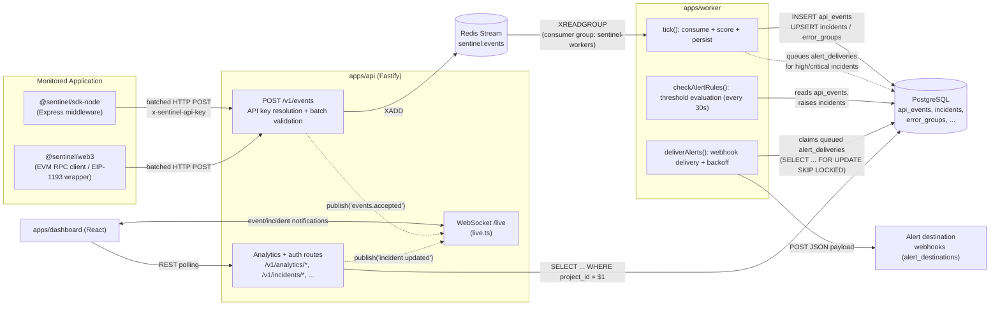
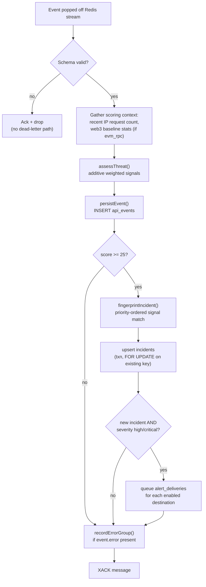
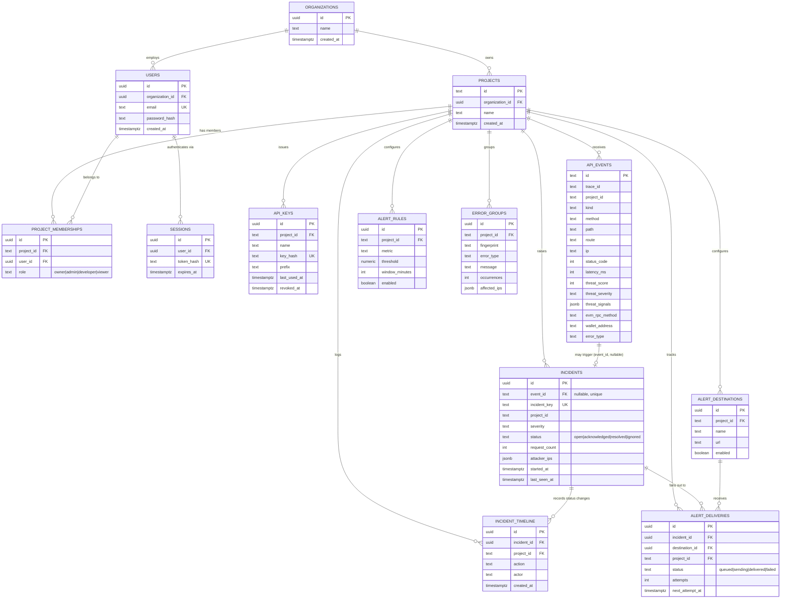

# Sentinel Architecture

This document describes how Sentinel is actually built: the runtime topology, the event
abstraction everything flows through, the worker's processing pipeline, the data model, and the
trust boundaries around authentication. It supersedes the shorter note that used to live at
`docs/architecture.md`. For the reasoning behind specific technology choices, see the ADRs linked
at the bottom rather than duplicated here.

## 1. Overview

Sentinel is a self-hosted API security and observability platform for Node.js applications. It
watches REST, GraphQL, and EVM JSON-RPC traffic through a lightweight SDK, normalizes everything
into one event shape, scores each event for threat signals, groups related signals into incidents,
and surfaces all of it in a dashboard with live updates.

The core design promise is that monitoring never becomes a liability for the application it
watches: the SDK captures data in-process and ships it asynchronously, the ingestion API does the
minimum work needed to accept and queue a batch, and every expensive operation — threat scoring,
incident correlation, error grouping, alert delivery — happens in a separate worker process against
its own database connection pool. A slow query in the analytics path, or a saturated worker, can
degrade Sentinel's own visibility, but it cannot make a monitored request wait longer for its own
response. This is also, deliberately, more than a threat-score gadget: the same event pipeline
that powers threat detection also powers request-latency and error observability, so operators get
one system for "is this endpoint slow" and "is this endpoint under attack" instead of two.

## 2. System diagram

Two flows share the worker as their hub: the primary event pipeline (SDK → ingestion → stream →
worker → Postgres → dashboard) and the alert fan-out that branches off it once an incident is
created (worker → `alert_deliveries` row → webhook `POST` to whatever URLs are registered in
`alert_destinations`).

## 3. The event abstraction

Every signal Sentinel ingests — a REST call, a GraphQL operation, an EVM JSON-RPC call — is
normalized into one shape: `SentinelEvent`, defined as a Zod schema in
`packages/shared/src/index.ts`. This is the single contract the whole system is built around:
the SDKs produce it, the ingestion API validates it, the worker consumes it, and every downstream
table and dashboard view is ultimately a projection of it.

The schema's shape reflects what actually gets used downstream:

- Identity and correlation: `id`, `traceId` (32-hex OTel-style trace id), `parentSpanId`,
  `projectId`, `serviceName`, `environment`, `timestamp`.
- `kind`: one of `rest`, `graphql`, `evm_rpc`, `websocket`, `webhook` (`TrafficKindSchema`) — the
  discriminator that downstream code branches on.
- `request`: method, path, an optional normalized `route`, `ip`, `userAgent`, `headers`, `query`,
  `body`, and an `auth` object (`present` / `scheme` / `failed`).
- `response`: `statusCode`, `latencyMs`, optional `bodyBytes`.
- `graphQL`: optional `operationName` / `operationType`, populated only when `kind === "graphql"`.
- `evmRpc`: optional `method`, `chainId`, `provider`, `walletAddress`, `contractAddress`, populated
  only when `kind === "evm_rpc"`.
- `error`: optional `type` / `message` / `stack`, populated when the SDK captured an exception via
  `sentinelErrorHandler()`.

Batches are validated as `EventBatchSchema`, an array of 1–100 `SentinelEvent`s
(`z.array(SentinelEventSchema).min(1).max(100)`).

The payoff of this abstraction is extensibility (expanded in §12): `classifyTraffic()` in
`packages/shared/src/index.ts` is the only place that decides what "kind" of traffic something is
(GraphQL is detected by path, EVM RPC by a `jsonrpc` + `method` body shape), and everything after
that point — scoring, persistence, incident grouping, the dashboard — operates on the same
`SentinelEvent` regardless of transport. A new SDK for a new runtime only has to produce a
conformant `SentinelEvent`; it doesn't need to know anything about Redis, Postgres, or how
incidents get raised.

## 4. Ingestion path

`POST /v1/events` in `apps/api/src/server.ts` does exactly four things, in order, and nothing more:

1. **Resolve the API key.** `resolveProjectForApiKey()` (`apps/api/src/db.ts`) checks the
   `x-sentinel-api-key` header against two possible identities: the shared fallback key
   (`SENTINEL_API_KEY`, defaulting to `dev-sentinel-key`) for local development, or a real,
   project-scoped key looked up by its SHA-256 hash in the `api_keys` table
   (`key_hash = sha256(apiKey)`, `revoked_at is null`). A hit updates `last_used_at`. A miss on
   both returns `401 invalid_api_key`.
2. **Validate the batch.** The body is parsed against `EventBatchSchema`. A schema failure returns
   `400 invalid_event_batch` with the Zod error detail and increments `failedIngestionBatches`.
3. **Enforce project scope.** Every event's `projectId` must match the project the resolved key is
   scoped to; any mismatch rejects the whole batch with `403 project_scope_mismatch`. This is what
   stops a key issued to one project from writing into another project's data.
4. **Enqueue and return `202`.** Valid events are pushed onto the Redis Stream via
   `enqueueEvents()` (`apps/api/src/queue.ts`, one `XADD` per event inside a pipeline), a
   `liveHub.publish("events.accepted", ...)` notification goes out over the WebSocket, and the
   route returns `202 Accepted` with a count. No database write happens in this request path.

This split — synchronous accept, asynchronous process — is the whole point of
[ADR-003](docs/adr/003-keep-ingestion-asynchronous.md): ingestion authenticates, validates,
scopes, and queues, and returns before anything touches Postgres or runs threat-scoring logic. A
slow worker or a slow database can build up queue depth (visible at `/ready` and `/metrics`), but
it cannot add latency to the monitored application's own request/response cycle.

## 5. Processing path (the worker)

`apps/worker/src/worker.ts` runs three loops back-to-back in an infinite `while (true)` (see the
bottom of the file): `tick()`, `deliverAlerts()`, `checkAlertRules()` (rate-limited to once per
30 seconds via `ALERT_RULE_EVAL_INTERVAL_MS`). Each is a full pass, not a fire-and-forget task —
the worker is a simple single-process consumer with no internal concurrency beyond what Postgres
and Redis give it for free.

`tick()` reads up to 25 messages via `XREADGROUP` against the `sentinel-workers` consumer group
(`BLOCK 5000` so it doesn't spin when idle), and for each message:

1. Parses the JSON payload back into a `SentinelEvent` with `SentinelEventSchema.safeParse`. A
   parse failure is silently acknowledged and dropped — there is no dead-letter path today.
2. On success, wraps the rest of the work in an OpenTelemetry span
   (`sentinel.worker.process_event`) and:
   - Fetches context needed for scoring in parallel: `countRecentIpRequests()` (requests from this
     IP in the last minute, for the generic rate-anomaly signal) and `getWeb3ThreatContext()`
     (only populated when `kind === "evm_rpc"`; see below).
   - Calls `assessThreat()` (`packages/shared/src/index.ts`) to score the event.
   - Persists the raw event via `persistEvent()` (`INSERT ... ON CONFLICT (id) DO NOTHING` into
     `api_events`, so redelivery from Redis is idempotent).
   - Calls `createIncidentIfNeeded()`, which fingerprints the event/assessment pair and
     upserts an `incidents` row (see below).
   - Calls `recordErrorGroup()`, which fingerprints any captured `error` and upserts an
     `error_groups` row.
3. Only after that whole span completes without throwing does the worker `XACK` the message.

**Threat scoring (`assessThreat`, `packages/shared/src/index.ts`).** This is a pure, additive
heuristic — not a model. Each applicable rule adds a weighted signal (`{name, weight, reason}`);
the final score is the sum of weights, capped at 100. Generic signals: `server_error` (+18, 5xx
response), `auth_failure` (+24, 401/403 or `request.auth.failed`), `high_latency` (+12, over
1500ms), `rate_anomaly` (+30, more than 120 requests/minute from the same IP),
`large_graphql_payload` (+14, GraphQL body over 10,000 characters). EVM-specific signals only fire
when `kind === "evm_rpc"`: `sensitive_rpc` (+26, method name matches
`/send|sign|private|unlock/i`), `rpc_flooding` (+28, over 200 calls/minute to the same method from
one IP), `tx_burst` (+30, a wallet's transaction-submission volume in the last hour is both ≥10 and
more than 10x its trailing 24-hour hourly baseline), `provider_degradation` (+20, an RPC provider's
5-minute p95 latency is over 500ms and more than 3x its 24-hour baseline), `provider_failures`
(+22, over 20% failure rate for a provider, with a minimum sample size of 5 requests to avoid
false positives on low volume). Severity buckets: `critical` ≥75, `high` ≥50, `medium` ≥25,
otherwise `low`.

**Incident fingerprinting (`apps/worker/src/incidents.ts`).** An event only becomes (or updates) an
incident if its score is ≥25. `fingerprintIncident()` checks signal names in a fixed priority order
— `auth_failure` → `tx_burst` → `rpc_flooding` → `provider_degradation` → `provider_failures` →
`rate_anomaly` → `sensitive_rpc` → a generic `heuristic_risk` fallback — and produces a stable
`incident_key` such as `demo:credential_stuffing:POST /login` or `demo:tx_burst:0xabc...123`. The
web3-specific checks are ordered ahead of the generic `rate_anomaly` check deliberately: a flood of
calls to one RPC method from one IP always also trips the generic per-IP rate signal, and the more
specific category produces a more useful incident title. `createIncidentIfNeeded()`
(`apps/worker/src/db.ts`) then runs a transaction that does a `SELECT ... FOR UPDATE` on any open
or acknowledged incident sharing that key: if one exists, it bumps `request_count`, merges
`attacker_ips`, and widens the `started_at`/`last_seen_at` window; if not, it inserts a new
`incidents` row. A brand-new `high` or `critical` incident additionally inserts one queued
`alert_deliveries` row per enabled `alert_destinations` row for the project, inside the same
transaction — the alert queue and the incident it belongs to are always created atomically.

**Error grouping (`apps/worker/src/errors.ts`).** `fingerprintError()` builds a key from
`projectId`, `error.type`, the endpoint (`METHOD route-or-path`), and a normalized error message
(`normalizeErrorMessage()` replaces UUIDs and bare integers with placeholders, so `"user 42 not
found"` and `"user 99 not found"` collapse into the same group). `recordErrorGroup()` upserts
`error_groups`, incrementing `occurrences` and merging `affected_ips`.

**Alert-rule evaluation (`apps/worker/src/alertRules.ts`), every 30 seconds.**
`evaluateAlertRules()` loads all `enabled` `alert_rules` and, per rule, runs a metric query scoped
to that rule's `window_minutes`: `error_rate_percent`, `p95_latency_ms`, `max_threat_score`,
`request_count`, or `auth_failure_count`. If the computed value exceeds `threshold`,
`raiseAlertRuleIncident()` upserts a synthetic incident keyed by
`{project_id}:alert_rule:{metric}` (severity always `high`) and queues alert deliveries the same
way event-triggered incidents do. This is a separate code path from per-event incident creation —
it catches sustained conditions (like a slowly rising error rate) that no single event would
trigger on its own.

**Alert delivery (`apps/worker/src/alerts.ts`).** `deliverPendingAlerts()` claims up to 10
due deliveries with `claimAlertDeliveries()` — an `UPDATE ... WHERE id IN (SELECT ... WHERE status
= 'queued' AND next_attempt_at <= now() ... FOR UPDATE SKIP LOCKED)` — which is what makes it safe
to run more than one worker process against the same delivery queue without double-sending a
webhook. Each claimed delivery gets a `POST` with a 5-second timeout
(`sendAlertWebhook()`); success marks it `delivered`, failure calls `markAlertDeliveryFailed()`,
which either schedules a retry with exponential backoff (`min(30 * 2^attempts, 3600)` seconds) or,
after 5 attempts, marks it `failed` permanently.

## 6. Data model

All persistent state lives in PostgreSQL, defined in `infra/migrations/001_initial.sql`.

A few details worth calling out beyond the ER shape: `incidents.event_id` is nullable and unique —
event-triggered incidents point at the `api_events` row that created them, but alert-rule-triggered
incidents (§5) have no single originating event, so `event_id` is `null` for those; the real
dedupe/merge key for all incidents is `incident_key`, which has its own unique index. `api_events`
itself has no foreign key to `projects` (it's a `text project_id` column, matched by convention,
not enforced by a constraint) — a pragmatic choice for a high-volume, insert-heavy table where
adding an FK would mean an index lookup against `projects` on every ingested event.

## 7. Authentication and authorization

Sentinel has two authentication mechanisms that coexist, and understanding where the line between
them falls is important for reasoning about who can do what.

**Project-scoped API keys** (`apps/api/src/db.ts`, `resolveProjectForApiKey` /
`hashApiKey`/`createApiKey`) authenticate SDK ingestion traffic and, when passed on read routes,
also scope analytics reads to a project. A real key looks like `sentinel_<24 random bytes,
base64url>`; only its SHA-256 hash is stored (`key_hash`), alongside a non-secret `prefix` used for
display in the dashboard's key list. There's also a special case: the value of `SENTINEL_API_KEY`
(the "shared fallback key," `dev-sentinel-key` by default) is accepted directly without a database
lookup and defaults callers to the `demo` project (or `?projectId=` if supplied) — this is what
lets `docker compose up` work out of the box without provisioning a real key first.

**Dashboard sessions** (`apps/api/src/auth.ts`, `apps/api/src/db.ts`) authenticate human operators.
Passwords are hashed with scrypt (`hashPassword`/`verifyPassword`, 16-byte random salt, 64-byte
derived key, constant-time comparison). On login, a session token
(`sentinel_session_<32 random bytes, base64url>`) is generated, SHA-256-hashed, and stored in
`sessions.token_hash` with a 7-day expiry (`SESSION_TTL_MS`); the raw token is only ever handed to
the client once, in the login response, as a bearer token. `getBearerToken()` pulls it from the
`Authorization: Bearer ...` header on subsequent requests. Roles — `owner` > `admin` > `developer`
> `viewer`, ranked in `ROLE_RANK` — are per-project, stored in `project_memberships`, and checked
with `roleMeetsMinimum()`.

**The nuance:** role enforcement is implemented in `enforceProjectRole()` in
`apps/api/src/server.ts`, and it only runs `if (getBearerToken(request))` — that is, only when a
session token is actually present on the request. If it's absent, `enforceProjectRole` returns
`true` immediately and the mutation proceeds. This is a deliberate design decision (the comment
directly above the function in `server.ts` spells it out): API-key-only callers — SDKs posting
events, automation scripts, or the shared dev fallback key hitting a mutating analytics route like
`POST /v1/api-keys` — are a coarser-grained trust tier than a human with a dashboard role, and are
simply not subject to the owner/admin/developer/viewer hierarchy at all. In other words, "does this
caller have a valid project-scoped API key" and "does this caller's session have the `admin` role
on this project" are two independent gates; a request needs to clear whichever one applies to it
(API key always, for scope; session role only if a session token was actually presented), not both
in every case. Every route documented as "requires `admin` role when called with a session token"
in the README is stating exactly this: the check is real, but it is conditional on the auth
mechanism in play.

## 8. Multi-tenancy

The tenancy hierarchy is organizations → projects → project memberships. `organizations` is the
top-level tenant boundary; `projects.organization_id` ties every project to one organization; and
`project_memberships` (unique on `(project_id, user_id)`) is the join table that grants a specific
user a specific role on a specific project — a user can belong to multiple projects with different
roles in each.

Every ingestion, analytics, and mutation path is scoped by `project_id`: ingestion rejects any
event whose `projectId` doesn't match the resolved key's project (§4); every analytics query in
`apps/api/src/db.ts` (`getOverview`, `getIncidents`, `getRequests`, `listApiKeys`,
`listAlertDestinations`, `listErrorGroups`, etc.) takes a `projectId` parameter and filters with
`where project_id = $1`; and every worker write (`persistEvent`, `createIncidentIfNeeded`,
`recordErrorGroup`) carries the event's own `projectId` through to the insert. There is a system
default: `getAnalyticsProjectScope()` falls back to the `demo` project when no API key header is
present at all, which is what backs the dashboard's offline/demo-data experience.

## 9. Real-time updates

`apps/api/src/live.ts` attaches a `WebSocketServer` at `/live` directly onto the Fastify HTTP
server. It has no channels or subscriptions in the protocol sense — every connected client receives
every published message (`{channel, payload}` as JSON), and the dashboard filters by `channel`
client-side. Two events are published today: `events.accepted` from the ingestion route (a live
counter of accepted batches) and `incident.updated` from `PATCH /v1/incidents/:id/status` (so an
operator changing an incident's status in one browser tab is reflected live in another). Publishing
is itself wrapped in an OpenTelemetry span (`sentinel.websocket.publish`) with the channel name and
current client count as attributes. Note that the worker does not publish to this hub directly —
newly created incidents and freshly scored events reach the dashboard by polling the analytics
routes, not over the WebSocket; live-tail today is a thin layer on top of the ingestion and
incident-status paths specifically, not a general event fan-out from the worker (`WebSocket event
fanout from worker results` is explicitly still on the roadmap — see `docs/roadmap.md`).

## 10. Self-hosted deployment topology

`docker-compose.yml` defines five things:

- **`postgres`** (`postgres:16-alpine`) — the migrations in `infra/migrations/` are mounted into
  `/docker-entrypoint-initdb.d`, so they run automatically on first boot of the volume.
- **`redis`** (`redis:7-alpine`) — the event stream and consumer-group state.
- **`api`** — built from `infra/node.Dockerfile` with `WORKSPACE=apps/api`, listening on `8080`.
- **`worker`** — built from the same `infra/node.Dockerfile` with `WORKSPACE=apps/worker`; no
  exposed port, since it only talks to Postgres and Redis.
- **`dashboard`** — built from `infra/dashboard.Dockerfile`, a Vite dev server on `5173`.

`api` and `worker` both wait on Postgres and Redis health checks (`service_healthy`) before
starting. Both use the same multi-stage `node.Dockerfile`: a `build` stage installs dependencies
and compiles `packages/shared` plus whichever workspace is being built, and the final stage copies
only the built output and `node_modules`, sets `NODE_ENV=production`, and — notably — runs as the
non-root `node` user (`USER node`, with `--chown=node:node` on every `COPY --from=build`) rather
than root. `infra/dashboard.Dockerfile` does the same (`chown -R node:node /app` then `USER node`).
Nothing in the compose file runs as root inside its container.

## 11. Failure handling and reliability

**Redis stream consumer group.** The worker joins the `sentinel-workers` consumer group on stream
`sentinel:events` (`XGROUP CREATE ... $ MKSTREAM`, tolerating the `BUSYGROUP` error if the group
already exists) under a consumer name of `worker-${process.pid}` by default
(`apps/worker/src/config.ts`). Redis Streams' consumer-group semantics mean that if you run more
than one worker process against the same group, each stream message is delivered to exactly one
consumer, so horizontal scaling of workers is a matter of starting more processes — no additional
partitioning logic needed. What the current code does *not* do is reclaim messages left pending by
a consumer that died mid-processing: there's no `XCLAIM`/`XAUTOCLAIM` call anywhere in the
codebase, so a message that was delivered but never acked (because its worker crashed before
finishing) stays in that consumer's Pending Entries List until something claims it. That's a real
gap worth knowing about if you're evaluating this for production use beyond its stated MVP scope.

**At-least-once processing, not exactly-once.** Within `tick()`, `XACK` is only called after the
per-message `withSpan("sentinel.worker.process_event", ...)` block completes without throwing —
it's the last line of the loop body, after persistence, incident creation, and error-group
recording. If any of those steps throws, the exception propagates out of `withSpan` (which records
it and re-raises) and the `XACK` call is skipped, leaving the message pending for eventual
redelivery. `persistEvent()`'s `INSERT ... ON CONFLICT (id) DO NOTHING` makes redelivered event rows
idempotent on `api_events.id`; incident and error-group updates are aggregate upserts, so
reprocessing the same event twice (a case that can't currently happen without a redelivery
mechanism being added, per the gap above, but would need care if one were) would double-count
`request_count` and `occurrences` — there's no per-message idempotency key for those aggregate
tables today.

**Alert delivery retries.** `claimAlertDeliveries()`'s `FOR UPDATE SKIP LOCKED` claim (§5) is a
separate reliability mechanism from the Redis consumer group — it's how multiple worker processes
could safely share the alert-delivery backlog without both sending the same webhook. Failed
deliveries retry with exponential backoff (`30 * 2^attempts` seconds, capped at 3600) up to 5
attempts, then are marked `failed` permanently with the last error message recorded.

**Operational visibility.** `GET /ready` and `GET /metrics` (`apps/api/src/observability.ts`)
report database round-trip latency and Redis Stream backlog (via `XINFO GROUPS`, falling back to
`XLEN` when no group exists yet) so an operator can see queue depth and readiness without
instrumenting anything themselves.

## 12. Extensibility

Because everything downstream of ingestion — scoring, persistence, incident correlation, error
grouping, the dashboard's queries — operates purely on `SentinelEvent`, adding support for a new
source of traffic is a matter of producing conformant events, not modifying the pipeline. A
hypothetical Python SDK, an Nginx log-tailing agent, or a Lambda extension (all named in
`docs/roadmap.md`'s "Later" section) would need to: shape its captured request/response data into
`SentinelEvent`, `POST` it in batches of up to 100 to `/v1/events` with a valid project API key, and
nothing else — it doesn't need to know about Redis Streams, the worker's threat-scoring rules, or
how the dashboard renders incidents. The `kind` field and its optional `graphQL`/`evmRpc` sub-shapes
are the only places a genuinely new traffic type would need a schema addition (as EVM RPC support
already demonstrates: `packages/web3` is a ~180-line package that reuses `SentinelClient` from
`packages/sdk-node` wholesale and only adds its own event-shaping logic).

## Links

- [ADR-001: Use PostgreSQL For Durable Storage](docs/adr/001-use-postgresql.md)
- [ADR-002: Use Redis Streams For MVP Queueing](docs/adr/002-use-redis-streams.md)
- [ADR-003: Keep Ingestion Asynchronous](docs/adr/003-keep-ingestion-asynchronous.md)
- [ADR-004: Redact Sensitive Data By Default](docs/adr/004-redact-sensitive-data-by-default.md)
- [Roadmap](docs/roadmap.md)
