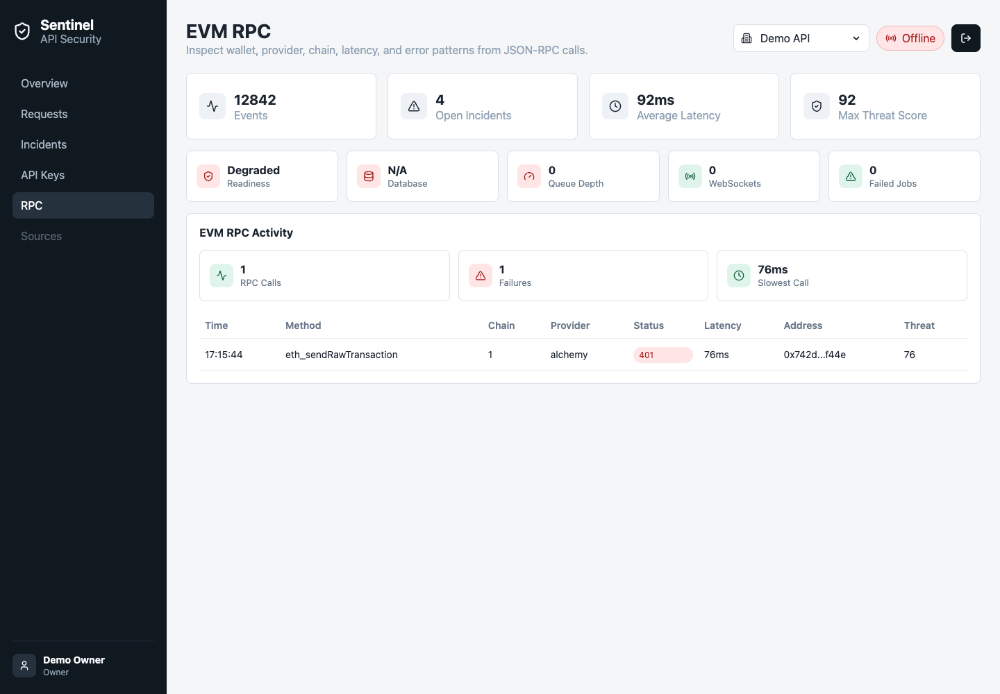

# Sentinel

**Sentinel catches the EVM RPC failures that return `200 OK`.**

Cross-provider verification, stale-head detection, silent-failure detection, and cost accounting for
Ethereum JSON-RPC traffic. Self-hosted, MIT licensed.



## The problem

Your app asks an RPC provider for a balance. The provider returns `200 OK`. Your monitoring is green.

But the provider may have answered from a node 40 blocks behind. Or returned `null` for a log query
it silently truncated. Or failed over to a backup region that disagrees with the primary. Or served
a block that got reorged out three seconds later. Every one of those is a `200 OK` with a
sub-100ms latency, and every one of them puts wrong data in front of your users or your keeper bot.

Nothing in a normal observability stack can see this. Datadog sees a fast HTTP 200. Sentry sees no
exception. Your provider's status page is green, because from their side nothing errored.

The only way to catch it is to check the *content* of RPC responses, and to compare providers
against each other at the same block height. That is what Sentinel does.

## What Sentinel detects

| Detector | What it catches | Status |
|---|---|---|
| **Stale head** | Provider serving a chain head that has stopped advancing, or that lags the fastest provider you use | Planned — [D1](docs/detectors.md#d1--stale-head) |
| **Cross-provider disagreement** | Two providers returning different results for the same call at the *same block height* | Planned — [D2](docs/detectors.md#d2--cross-provider-disagreement) |
| **Silent failure** | `200 OK` carrying `result: null`, an empty log range, or a JSON-RPC error inside a success body | Planned — [D3](docs/detectors.md#d3--silent-failure) |
| **Reorg lag** | Providers that keep serving a block after it has been reorged out, and how deep the reorg went | Planned — [D4](docs/detectors.md#d4--reorg-lag) |
| **Throttling as success** | Rate limiting that arrives as degraded results rather than `429` | Planned — [D5](docs/detectors.md#d5--throttling-as-success) |
| **Cost and waste** | Compute units burned per method, and duplicate identical calls within the same block | Planned — [D6](docs/detectors.md#d6--cost-and-waste) |
| **Provider degradation** | p95 latency regression against the provider's own recent baseline | **Shipping** |
| **Provider failure rate** | Abnormal share of hard failures from one provider | **Shipping** |
| **RPC flooding** | One method called far above its normal rate from a single source | **Shipping** |
| **Transaction burst** | Wallet submission volume spiking above its historical baseline | **Shipping** |

See [docs/detectors.md](docs/detectors.md) for the precise definition, inputs, and false-positive
handling for each one.

## Honest status

Sentinel today is a **working self-hosted pipeline** — SDK, ingestion API, queue, worker, threat
engine, Postgres, dashboard, incidents, alerting — with **per-call RPC observability**: method,
chain, provider, latency, and hard failures.

The content-aware detectors above (D1–D6) are **not built yet**. They require capturing and
normalizing RPC *results*, which the current recorder deliberately discards. That work is
[Phase 1 of the roadmap](docs/roadmap.md) and it is the reason this project exists.

This README describes where Sentinel is going and marks clearly what already runs. Nothing in the
"Shipping" rows above is aspirational.

## Use it

`@sentinel/web3` is not on npm yet ([Phase 4](docs/roadmap.md#phase-4--adoption)) — build it from
this repo with `npm install && npm run build`.

Wrap any EIP-1193 provider:

```ts
import { wrapEip1193Provider } from "@sentinel/web3";

const provider = wrapEip1193Provider(window.ethereum, {
  projectId: "my-project",
  apiKey: process.env.SENTINEL_API_KEY!,
  endpoint: "https://sentinel.internal",
  chainId: 1,
  provider: "alchemy"
});
```

Or use the viem transport:

```ts
import { createPublicClient } from "viem";
import { mainnet } from "viem/chains";
import { sentinelTransport } from "@sentinel/web3";

const client = createPublicClient({
  chain: mainnet,
  transport: sentinelTransport({
    projectId: "my-project",
    apiKey: process.env.SENTINEL_API_KEY!,
    endpoint: "https://sentinel.internal",
    rpcUrl: process.env.EVM_RPC_URL!,
    chainId: 1,
    provider: "alchemy"
  })
});
```

Your RPC URL never leaves your process. Sentinel records a hash of the endpoint, never the URL
itself, because provider URLs embed API keys.

## Run it

```bash
git clone https://github.com/macjayz/sentinel.git
cd sentinel
docker compose up --build
```

Open `http://localhost:5173` and sign in with `owner@sentinel.local` / `sentinel-demo`, or create
your own account. The `demo` project is seeded with realistic sample traffic on first boot.

The dashboard runs at `http://localhost:5173`, the API at `http://localhost:8080`.

## How it works

```text
Your app
  |
@sentinel/web3          EIP-1193 wrapper / viem transport
  |
Ingestion API           validates, scopes to project, never blocks your app
  |
Redis Stream            your RPC calls are never slowed by Sentinel's storage
  |
Worker + detectors      scoring, cross-provider comparison, incident grouping
  |
PostgreSQL
  |
Dashboard + WebSocket
```

The SDK never writes to the database directly. RPC calls in your application are not slowed by
Sentinel's storage layer, and a Sentinel outage cannot take down your app.

Full design in [ARCHITECTURE.md](ARCHITECTURE.md).

## Supporting capability: your service's HTTP traffic

Sentinel also instruments Express, REST, and GraphQL traffic through `@sentinel/sdk-node`. This
exists so that an RPC incident can be correlated with the request that triggered it — when a
provider goes stale, you want to see which of your endpoints served bad data because of it.

```ts
import { sentinelExpress } from "@sentinel/sdk-node";

app.use(sentinelExpress({
  projectId: "my-project",
  apiKey: process.env.SENTINEL_API_KEY!,
  endpoint: "https://sentinel.internal",
  serviceName: "payments-api"
}));
```

This is a supporting feature, not the product. If you want general-purpose APM, use Sentry,
Datadog, or OpenTelemetry — they are better at it and always will be.

## Operations

- Self-hosted. Your RPC telemetry never leaves your infrastructure.
- Multi-tenant: organizations, projects, project-scoped API keys, server-enforced roles.
- Sensitive fields, headers, private keys, and mnemonics redacted by default.
- OpenTelemetry spans throughout; exporters left to the deployer.
- `GET /health`, `GET /ready`, `GET /metrics` for orchestration.
- Alert rules with webhook destinations and delivery records.

Full endpoint list and auth model in [ARCHITECTURE.md](ARCHITECTURE.md).

## Verification

```bash
npm run typecheck && npm test && npm run lint && npm run build
```

## Roadmap

See [docs/roadmap.md](docs/roadmap.md). Phase 1 is result capture and the first content-aware
detectors; Phase 2 is cross-provider verification; Phase 3 publishes a public measurement study of
RPC provider reliability built with this tool.

## Architectural decisions

- [ADR-001: Use PostgreSQL For Durable Storage](docs/adr/001-use-postgresql.md)
- [ADR-002: Use Redis Streams For MVP Queueing](docs/adr/002-use-redis-streams.md)
- [ADR-003: Keep Ingestion Asynchronous](docs/adr/003-keep-ingestion-asynchronous.md)
- [ADR-004: Redact Sensitive Data By Default](docs/adr/004-redact-sensitive-data-by-default.md)

## Contributing

See [CONTRIBUTING.md](CONTRIBUTING.md). Good first issues are tagged in the tracker.

## License

MIT
