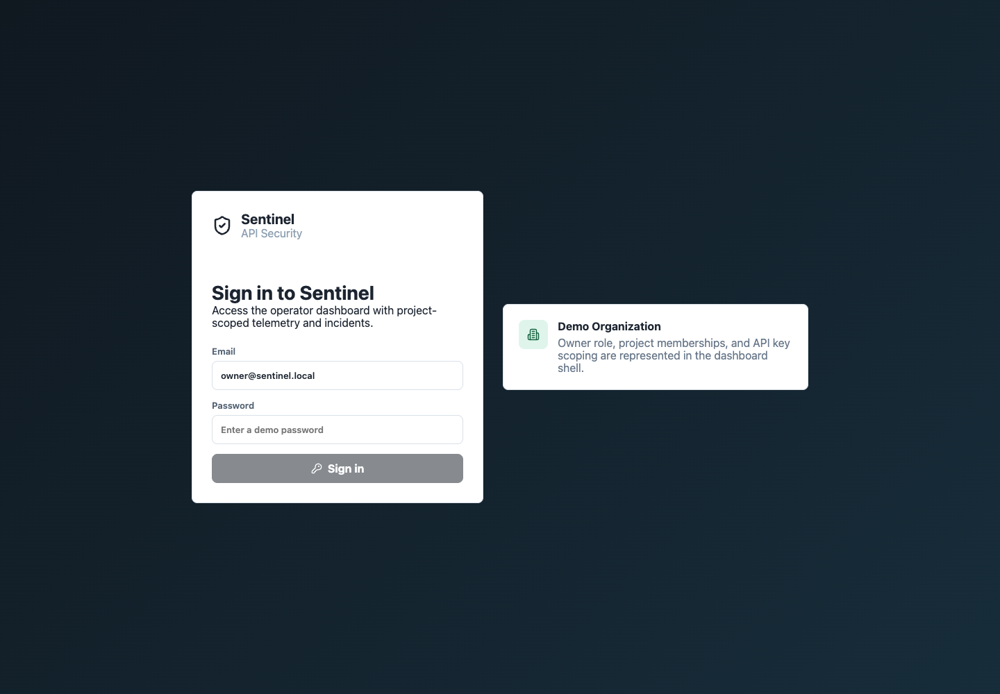
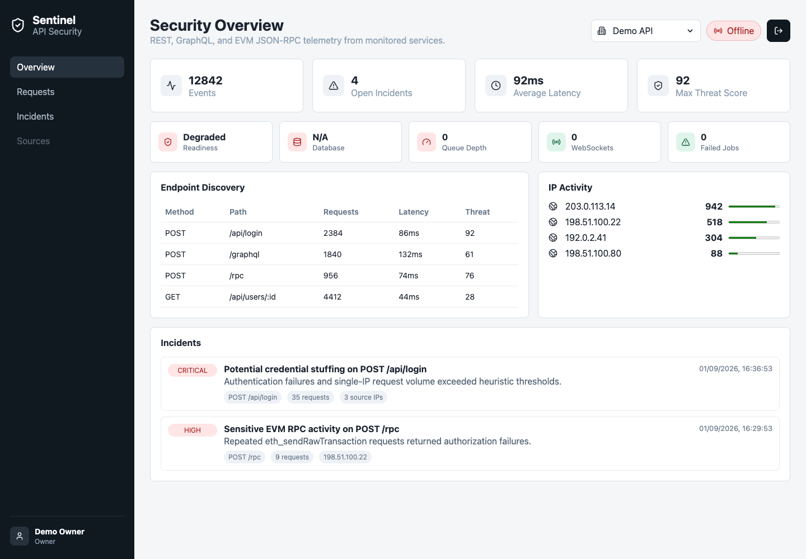
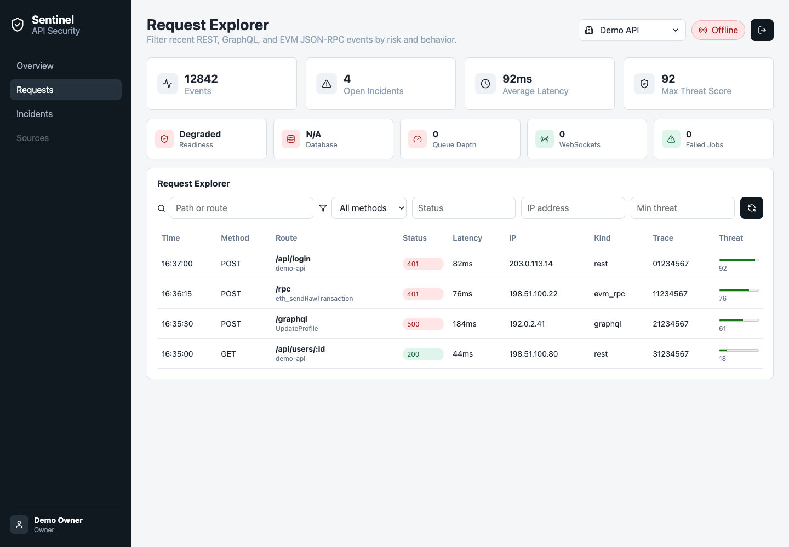

# Sentinel

Self-hosted API security and observability for Node.js applications.

Sentinel monitors REST, GraphQL, WebSocket, webhook, and EVM JSON-RPC traffic through a lightweight SDK, an ingestion pipeline, a threat engine, and a dashboard. The MVP focuses on Express applications while keeping the architecture modular enough for additional runtimes and chains later.







## MVP Scope

Sentinel v0 targets:

- Node.js applications
- Express middleware
- REST and GraphQL request monitoring
- Ethereum/EVM JSON-RPC monitoring
- Request and response metadata
- Trace IDs for request correlation
- Organization and project scoped storage
- Latency, error, endpoint, IP, and authentication failure tracking
- Configurable sensitive-field redaction
- Abnormal request-rate detection
- API Threat Score calculation
- Incidents and security events
- Real-time dashboard updates
- Docker-based self-hosting

Out of scope for the first release:

- Kubernetes operator
- Python, Go, and mobile SDKs
- Solana support
- Machine-learning threat detection
- Enterprise SSO
- Billing
- Multi-region deployment
- Full SIEM features
- Packet-level network inspection
- WAF replacement
- Vulnerability scanning

## Architecture

```text
User Application
  |
Sentinel SDK
  |
Ingestion API
  |
Event Queue
  |
Worker and Threat Engine
  |
PostgreSQL
  |
Analytics API and WebSocket API
  |
Dashboard
```

SDK traffic never writes directly to the database. Events move through the ingestion API and queue first, so monitored applications are protected from database latency and traffic bursts.

## Packages

The repository is organized as a TypeScript monorepo:

- `apps/api`: ingestion, analytics, and WebSocket API
- `apps/worker`: queue consumer, aggregation, and incident creation
- `apps/dashboard`: operator dashboard
- `packages/sdk-node`: Express middleware and Node client
- `packages/shared`: common schemas, redaction, scoring, and types
- `infra`: Docker Compose and database migrations

## Why This Project Matters

Most teams can see application logs, but they cannot easily answer security-focused API questions:

- Which endpoints are newly discovered?
- Which IPs are causing authentication failures?
- Which GraphQL operations are slow or failing?
- Which EVM JSON-RPC methods are risky?
- Which requests should become incidents?
- Which related security signals belong to the same incident?

Sentinel is designed to make those answers visible in a self-hosted stack developers can understand and extend.

## Status

Sentinel is under active MVP implementation.

## Local Development

Install dependencies:

```bash
npm install
```

Run the full self-hosted stack:

```bash
docker compose up --build
```

Run services locally:

```bash
npm run dev
```

Use the Express example after the API is running:

```bash
npm run dev -w examples/express
```

Seed realistic demo traffic after the API and worker are running:

```bash
npm run seed:demo
```

The dashboard runs at `http://localhost:5173` and the API runs at `http://localhost:8080`.

Operational endpoints:

- `GET /health`: process liveness
- `GET /ready`: database and queue readiness
- `GET /metrics`: Prometheus-style Sentinel runtime metrics
- `GET /v1/analytics/system`: JSON system metrics for the dashboard
- `GET /v1/analytics/requests`: recent request explorer data with method, status, IP, path, and threat filters

Dashboard access:

- The dashboard includes a local sign-in shell for the MVP operator experience.
- Demo access uses `owner@sentinel.local` with any non-empty password while full password auth is being implemented.
- The signed-in shell shows the current organization, operator role, and selected project.
- The project switcher scopes dashboard analytics requests and keeps offline demo data project-aware.

Multi-tenancy:

- Projects belong to organizations.
- API keys are scoped to projects.
- Ingestion rejects events whose `projectId` does not match the API key scope.
- Analytics queries default to the demo project and are structured to filter by `project_id`.

Tracing:

- SDK events include a `traceId`.
- Ingestion, Redis enqueue, worker processing, PostgreSQL writes, and WebSocket fanout are wrapped in OpenTelemetry spans.
- Exporters are intentionally left to deployers so self-hosters can connect Sentinel to their own collector.

## Example SDK Usage

```ts
import express from "express";
import { sentinelExpress } from "@sentinel/sdk-node";

const app = express();

app.use(
  sentinelExpress({
    projectId: "demo",
    apiKey: "dev-sentinel-key",
    endpoint: "http://localhost:8080",
    serviceName: "payments-api"
  })
);
```

## Verification

```bash
npm run typecheck
npm test
npm run lint
npm run build
```

## Roadmap

See [docs/roadmap.md](docs/roadmap.md).

## Architectural Decisions

- [ADR-001: Use PostgreSQL For Durable Storage](docs/adr/001-use-postgresql.md)
- [ADR-002: Use Redis Streams For MVP Queueing](docs/adr/002-use-redis-streams.md)
- [ADR-003: Keep Ingestion Asynchronous](docs/adr/003-keep-ingestion-asynchronous.md)
- [ADR-004: Redact Sensitive Data By Default](docs/adr/004-redact-sensitive-data-by-default.md)

## License

MIT
